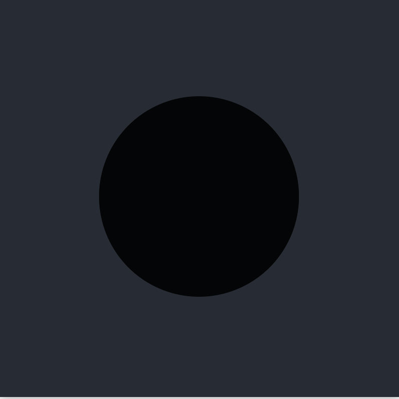
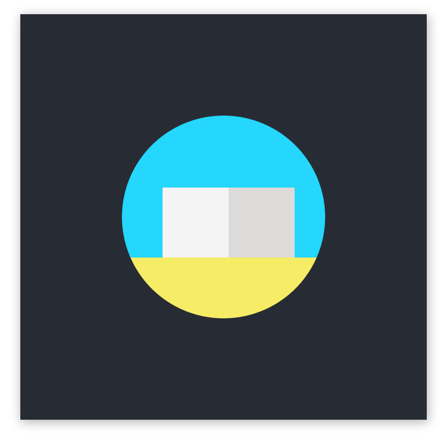
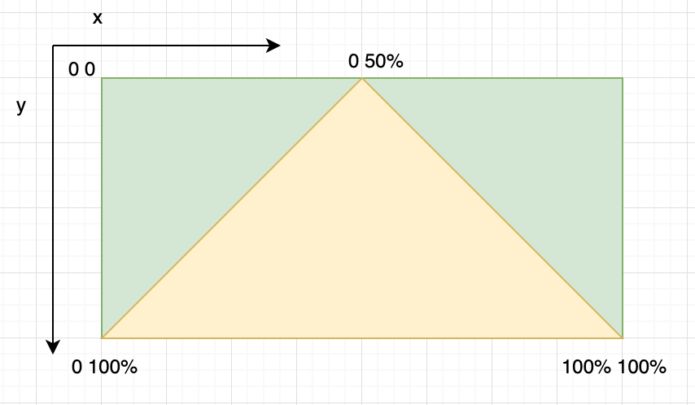

<br />

I have been starting to take CSS Challenges recently. Some of them are actually very interesting and entertaining to learn and create.
Today, I will write about Day 2 challenge which is to create an animated sunrise and sunset over a pyramid using CSS

# Demo 
You can take a look at the original demo link below.

https://100dayscss.com/?dayIndex=2

# Create static components
## Creating the frame
To begin with, let's create the html structure.

```html
<div class="container">
  <div class="frame">
      <div class="sun"></div>
      <div class="sky">
      <div class="pyramid-left pyramid-side"></div>
      <div class="pyramid-right pyramid-side"></div>
    </div>
    
    <div class="ground">
      <div class="shadow"></div>
    </div>
  </div>
</div>
```
Next is the basic css styling for these components. First we need to style the body to expand the whole width and height of current view. 
Then, we need to create a container with a black background.

```scss
body {
  width: 100vw;
  height: 100vh;
  display: flex;
  justify-content: center;
  align-items: center;
}

$container-size: 400px;
.container {
  width: $container-size;
  height: $container-size;
  display: flex;
  box-shadow: 1px 2px 10px 0px rgba(0, 0, 0, 0.3);
  background: #272c34;
  justify-content: center;
  align-items: center;
}

```
Next, we need to style our `frame` which will contain all of our components.
Let's say we want our frame to be about 200px less in size of our container. You can choose whichever number as you wish.
To make our frame has a round shape, it is important to have `overflow: hidden` and `border-radius: 50%

```scss
$frame-size: $container-size - 200px;
.frame {
  position: relative;
  width: $frame-size;
  height: $frame-size;
  border-radius: 50%;
  background: #000;
  overflow: hidden;
}
```
Here is what we got
<div style="text-align: center; margin: 0 auto; width: 400px">
    
</div>

### Creating the sky, ground
The proportion of the sky and ground would be 70 and 30 respectively. You can adjust the number for your own reference.
In this tutorial, I found these two numbers feasible to use. 
We would want to set both components `position: relative` so that we could make their child components in place when we set them `position: absolute` later.
```scss
.sky {
  background: #00d6ff;
  height: 70%;
  position: relative;
}

.ground {
  height: 30%;
  background: #f7ee5a;
  position: relative;
}
```

### Creating the pyramid

When I first tried this challenge, I thought of using `:after` and `:before` along with creating borders for the elements to make the triangles of the pyramid.
If you are curious about that technique, you can read more
<a alt="triangle-techniques-with-css" href="http://blog.michelledinan.com/08/2012/drawing-triangles-with-css/#obtuse" target="_blank">here</a>.
However, after a bit of the hassle, I discovered that there was another easier way to do it, which is to use
<a alt="clip-path" href="https://developer.mozilla.org/en-US/docs/Web/CSS/clip-path">clip-path</a>. `clip-path` allows 
us to create a wide variety of shapes for our components.

To create the pyramid, instead of creating two obtuse triangles leaning on each other, we can create a normal triangle and having an obtuse one on top of it.
By doing this, it would save us the pain of keeping two triangles matching angles. 

```scss
$pyramid-width-left: 130px;
$pyramid-height: 70px;
$pyramid-left-position: 40px;

.pyramid-left {
  background: #f4f4f4;
  
  width: $pyramid-width-left;
  height: $pyramid-height;
  position: absolute;

  bottom: -1px;
  
  left: $pyramid-left-position;
}

.pyramid-right {
  background: #dddada;

  width: $pyramid-width-left / 2;
  height: $pyramid-height;
  
  position: absolute;
  
  bottom: -1px;
  
  left: $pyramid-width-left / 2 + $pyramid-left-position;
}
```

To give us the freedom of position of two triangles, it would make sense to make them `position: absolute`.
In the code, let's make the height, left position and the width of big triangle into variables.
They would make it possible for us create relative position between the two. 
Let's make two blocks, one for big triangle and one for smaller one.

Here we have a grey box being on top of another one. 
<div style="text-align: center; margin: 0 auto; width: 400px; margin-bottom: 20px">
    
</div>

Here is the fun part, let's shape these boxes into triangles with `clip-path`. We will use a property to `polygon`. 
`polygon` allows us to pass in as many pairs of coordinates by percentages of the component to clip the shape.
(0, 0) is the top left of the component.

To clip a box into a triangle, we need three points, I have made an image to make it easier to illustrate how we can do it.

<div style="text-align: center; margin: 0 auto; width: 400px">
    
</div>

```scss
$pyramid-width-left: 130px;
$pyramid-height: 70px;
$pyramid-left-position: 40px;

.pyramid-left {
  background: #f4f4f4;
  
  width: $pyramid-width-left;
  height: $pyramid-height;
  position: absolute;

  bottom: -1px;
  
  left: $pyramid-left-position;
  
  // highlight-next-line
  clip-path: polygon(0% 100%, 100% 100%, 50% 0%);

}

.pyramid-right {
  background: #dddada;

  width: $pyramid-width-left / 2;
  height: $pyramid-height;
  
  position: absolute;
  
  bottom: -1px;
  
  left: $pyramid-width-left / 2 + $pyramid-left-position;
}
```
  
<hr />
