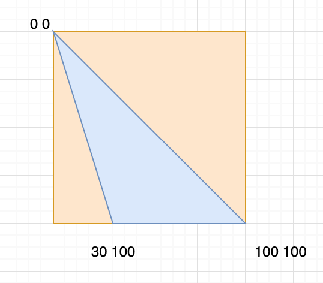
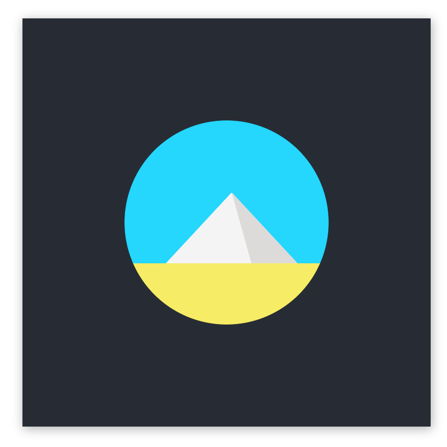
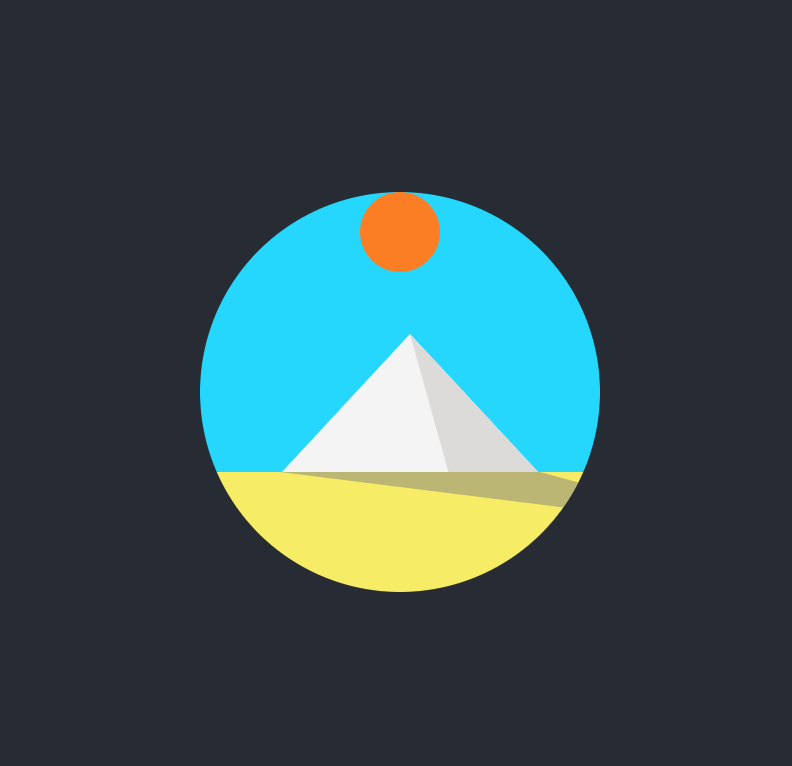
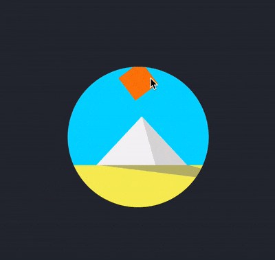
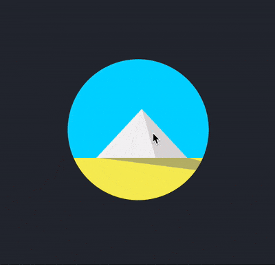

I have been starting to take CSS Challenges recently. Some of them are actually very interesting and entertaining to learn and create.
Today, I will write about Day 2 challenge which is to create an animated sunrise and sunset over a pyramid using CSS

# Demo 
You can take a look at the original demo link below.

https://100dayscss.com/?dayIndex=2

# Create static components
## Creating the frame
To begin with, let's create the html structure.

```html
<div class="container">
  <div class="frame">
      <div class="sun"></div>
      <div class="sky">
      <div class="pyramid-left pyramid-side"></div>
      <div class="pyramid-right pyramid-side"></div>
    </div>
    
    <div class="ground">
      <div class="shadow"></div>
    </div>
  </div>
</div>
```
Next is the basic css styling for these components. First we need to style the body to expand the whole width and height of current view. 
Then, we create a container with a black background.

```scss
body {
  width: 100vw;
  height: 100vh;
  display: flex;
  justify-content: center;
  align-items: center;
}

$container-size: 400px;
.container {
  width: $container-size;
  height: $container-size;
  display: flex;
  box-shadow: 1px 2px 10px 0px rgba(0, 0, 0, 0.3);
  background: #272c34;
  justify-content: center;
  align-items: center;
}

```
Next, we will style a `frame` to contain all of our components.
Let's say we want the frame to be about 200px less in size of our container. You can choose whichever number as you wish.
To make the frame a round shape, it is important to have `overflow: hidden` and `border-radius: 50%`

```scss
$frame-size: $container-size - 200px;
.frame {
  position: relative;
  width: $frame-size;
  height: $frame-size;
  border-radius: 50%;
  background: #000;
  overflow: hidden;
}
```
Here is what we got
<div style="text-align: center; margin: 0 auto;">
    
</div>

### Creating the sky, ground
The proportion of the sky and ground could be 70 and 30 respectively. You can adjust the number for your own reference.
In this tutorial, I found these two numbers feasible to use. 
We would want to set both components `position: relative` to make it possible to position their children components with `position:absolute`
```scss
.sky {
  background: #00d6ff;
  height: 70%;
  position: relative;
}

.ground {
  height: 30%;
  background: #f7ee5a;
  position: relative;
}
```

### Creating the pyramid

When I first tried this challenge, I thought of using `:after` and `:before` along with creating borders for the elements to make the triangles of the pyramid.
If you are curious about that technique, you can read more
<a alt="triangle-techniques-with-css" href="http://blog.michelledinan.com/08/2012/drawing-triangles-with-css/#obtuse" target="_blank">here</a>.
However, after a bit of the hassle, I discovered that there was an easier way to do it, which is to use
<a alt="clip-path" href="https://developer.mozilla.org/en-US/docs/Web/CSS/clip-path">clip-path</a>. `clip-path` allows 
us to create a wide variety of shapes for our components.

To create the pyramid, instead of creating two obtuse triangles leaning on each other, we can create a normal triangle and having an obtuse one on top of it.
By doing this, it would save us the pain of keeping two triangles matching angles with each other. 

```scss
$pyramid-width-left: 130px;
$pyramid-height: 70px;
$pyramid-left-position: 40px;

.pyramid-left {
  background: #f4f4f4;
  
  width: $pyramid-width-left;
  height: $pyramid-height;
  position: absolute;

  bottom: -1px;
  
  left: $pyramid-left-position;
}

.pyramid-right {
  background: #dddada;

  width: $pyramid-width-left / 2;
  height: $pyramid-height;
  
  position: absolute;
  
  bottom: -1px;
  
  left: $pyramid-width-left / 2 + $pyramid-left-position;
}
```

To give us the freedom of position of two triangles, it would make sense to have `position: absolute` for such components.
In the code, let's make the height, left position and the width of the big triangle into variables.
They would make it possible for us create relative position between the two triangles. 
Let's make two blocks, one for big triangle and one for smaller one.

Here we have a grey box being on top of white one. 

<div style="text-align: center; margin: 0 auto; margin-bottom: 20px">
    
</div>

Here is the fun part, let's shape these boxes into triangles with `clip-path`. We will use a property called `polygon`. 
`polygon` allows us to pass in as many pairs of coordinates by percentages of the component to clip the box into shape.
(0, 0) is the top left of the component.

To clip a box into a triangle, we need three points, I have made two images to make it easier to illustrate how we can do it.

<div style="text-align: center; margin: 0 auto; margin-bottom: 20px">
    
</div>

<div style="text-align: center; margin: 0 auto; margin-bottom: 20px">
    
</div>

Let's put these coordinates into `clip-path`.

```scss
$pyramid-width-left: 130px;
$pyramid-height: 70px;
$pyramid-left-position: 40px;

.pyramid-left {
  background: #f4f4f4;
  
  width: $pyramid-width-left;
  height: $pyramid-height;
  position: absolute;

  bottom: -1px;
  
  left: $pyramid-left-position;
  
  // highlight-next-line
  clip-path: polygon(0% 100%, 100% 100%, 50% 0%);
}

.pyramid-right {
  background: #dddada;

  width: $pyramid-width-left / 2;
  height: $pyramid-height;
  
  position: absolute;
  
  bottom: -1px;
  
  left: $pyramid-width-left / 2 + $pyramid-left-position;

  // highlight-next-line
  clip-path: polygon(0% 0%, 100% 100%, 30% 100%);

}
```

<div style="text-align: center; margin: 0 auto; margin-bottom: 20px">
    
</div>


### Creating the sun and the pyramid's shadow

Now, let's create css for the sun.
The first position of the sun is very important here because it determines the movement of the sun in the animation.
The center of the sun needs to be in the middle of the frame. I will explain more why when we get to the animation part.

```scss
$sun-size: 40px;
.sun {
  z-index: 1;
  
  width: $sun-size;
  height: $sun-size;
  
  position: absolute;
  overflow: hidden;
  border-radius: 100%;
  
  background: #fd7e08;
  
  left: $frame-size / 2 - $sun-size / 2;
}
```
As for the shadow, we will do the same as we created the pyramid. 
To create a triangle shape, let's create a div block below the pyramid.
It will have the width of its container. 
  
```scss
$shadow-left-position: 50px;
.shadow {
    background: #80808080;
    height: 50%;
    width: 100%;
    position: absolute;
    clip-path: polygon($pyramid-left-position 0, $pyramid-width-left 0, 140% 100%);
}
```
<div style="text-align: center; margin: 0 auto; margin-bottom: 20px">
    
</div>

# Creating <a href="https://www.w3schools.com/css/css3_animations.asp" target="_blank">animation</a>
We have all the components, it's time for the fancy animation. We will use css 
`animation` and `keyframe` to define rules for such animation.

## Moving sun
Below is how we do it in css.
```scss
$cubic-bezier: cubic-bezier(0.4, 0, 0.49, 1);

.sun {
  z-index: 1;
  width: $sun-size;
  height: $sun-size;
  position: absolute;
  overflow: hidden;
  border-radius: 100%;
  background: #fd7e08;
  left: $frame-size / 2 - $sun-size / 2;
  
  // highlight-next-line
  animation: sun-movement 4s $cubic-bezier infinite;
}

@keyframes sun-movement {
  0% {
    transform: rotate(-80deg);
  }
  30% {
    transform: rotate(-20deg);
  }
  100% {
    transform: rotate(70deg);
  }
}
```
At this step, the sun is actually spinning around itself. I have made the sun square so that we can see the spinning.

<div style="text-align: center; margin: 0 auto; margin-bottom: 20px">
    
</div>

But here is the magic, if we change <a target="_blank" href="https://www.w3schools.com/cssref/css3_pr_transform-origin.asp">transform-origin</a> to `50% 400%`, then we will have our sunrise and sunset.
This is because `transform-origin` allows us to change the position of transformed elements. 
In other words, the position where the rotation based on has changed. 

The default `transition-origin` is 50% 50% which is at the center of the element. 
In our case, it is at the center of the sun. When we give it a value of `50% 400%`, we have moved that position along y-axis four times the height of the sun. 
I chose the value of `400%` because it would make the sun move across the frame. You can definitely choose whichever you find fit. 

However, we need to place the sun in the middle of the frame for the sun to move across the frame as we expected.
That is why I mentioned above the left position is really important. 

## Animating the pyramid 
We would like to see two sides of the pyramid changing colors as the sun moves. We can define one `keyframe`
and reuse for the both triangles with opposite animation direction. 
To reverse the animation, we can declare `animation-direction: reverse` or using inline value on `animation`

```scss
.pyramid-left {
  background: #f4f4f4;
  width: $pyramid-width-left;
  height: $pyramid-height;
  position: absolute;

  clip-path: polygon(0% 100%, 100% 100%, 50% 0%);
  bottom: -1px;
  left: $pyramid-left-position;
  
  // highlight-next-line
   animation: pyramid-shading 4s $cubic-bezier infinite reverse;
}

.pyramid-right {
  width: $pyramid-width-left / 2;
  height: $pyramid-height;
  position: absolute;
  background: #dddada;
  bottom: -1px;
  clip-path: polygon(0% 0%, 100% 100%, 30% 100%);
  left: $pyramid-width-left / 2 + $pyramid-left-position;
  
  // highlight-next-line
  animation: pyramid-shading 4s $cubic-bezier infinite;
}

@keyframes pyramid-shading {
  0% {
    background: #dddada;
  }
  30% {
     background: #dddada;
  }
  60% {
    background: #f4f4f4;
  }
  100% {
      background: #f4f4f4;
  }
}
```
<div style="text-align: center; margin: 0 auto; margin-bottom: 20px">
    
</div>

## Animating the shadow
To animate the shadow, we need to change the pointy corner of the triangle to different position in the `keyframe`.
That pointy angle would move from the right to the left of the pyramid as the sun moves. 

We can do that by modifying the third arguments of the `polygon` to run from 140% to -40% of the `x-axis`
And to make the shadow shrink while the sun is at the top of the pyramid, we can scale the shadow to a value smaller than 1 at the middle of our animation cycle.


```scss
.shadow {
  transform-origin: 50% 0%;
  background: #80808080;
  height: 50%;
  width: 100%;
  position: absolute;
  clip-path: polygon($pyramid-left-position 0, $pyramid-width-left + $pyramid-left-position 0, 140% 100%);
  
  // highlight-next-line
  animation: shadow-movement 4s $cubic-bezier infinite;
}

@keyframes shadow-movement {
  0% {
    transform: scaleY(0);
    clip-path: polygon($pyramid-left-position 0, $pyramid-width-left + $pyramid-left-position 0, 140% 100%);
  }

  30% {
    transform: scaleY(1);
    clip-path: polygon(
      $pyramid-left-position 0, $pyramid-width-left + $pyramid-left-position 0,
      70% 100%
    );
  }
  50% {
    transform: scaleY(0.4);
  }
  75% {
    transform: scaleY(1);
  }
  100% {
    transform: scaleY(0);
    clip-path: polygon($pyramid-left-position 0, $pyramid-width-left + $pyramid-left-position 0, -40% 100%);
  }
}
```

### Creating the animation for the frame
Last but not least, if you look at the demo, you would see that the frame actually has the effect of fade-in and fade-out as the sun goes up and down.
To make it simple, I prefer to create the fading effect for the frame instead of creating fading effect for the sky and the ground. 
What we are doing here is to make the `opacity` change value from 0.3 to 1 in the animation cycle. 

```scss
.frame {
  position: relative;
  width: $frame-size;
  height: $frame-size;
  background: #000;
  border-radius: 50%;
  overflow: hidden;
  
  // highlight-next-line
  animation: fading 4s ease infinite;
}

@keyframes fading {
  0% {
    opacity: 0.3;
  }
  
  30% {
    opacity: 1;
  }
  
  60% {
    opacity: 1;
  }
  
  100% {
    opacity: 0;
  }
}
```
And we have created an animated sunrise and sunset over a pyramid with pure CSS.

# Summary
Here are a few notes to take away from this tutorial
- Transition-origin can be helpful to control transform movement in some cases.
- `clip-path` could be very handy when it comes to clipping shape of an element.
- Animation direction could help to reduce creating two animation rules in some cases (changing colors two sides of the pyramid)


That's it! Thank you reading!
