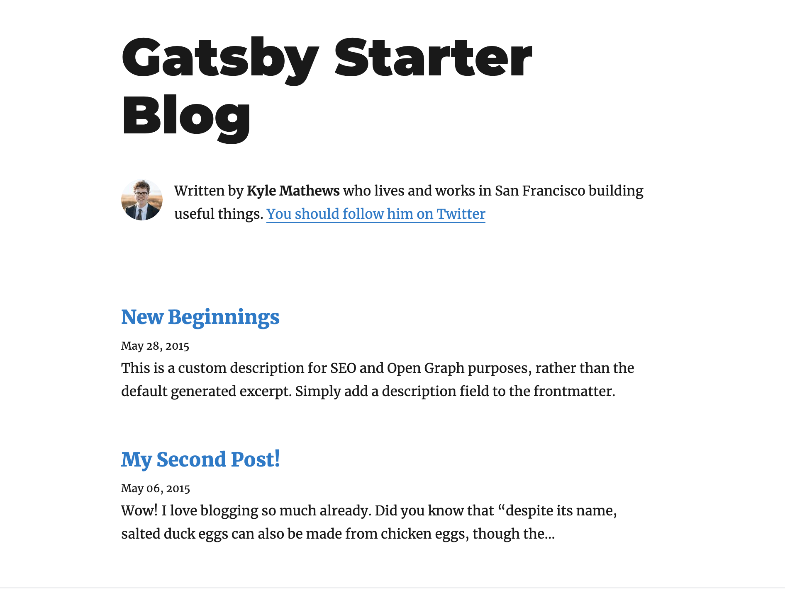
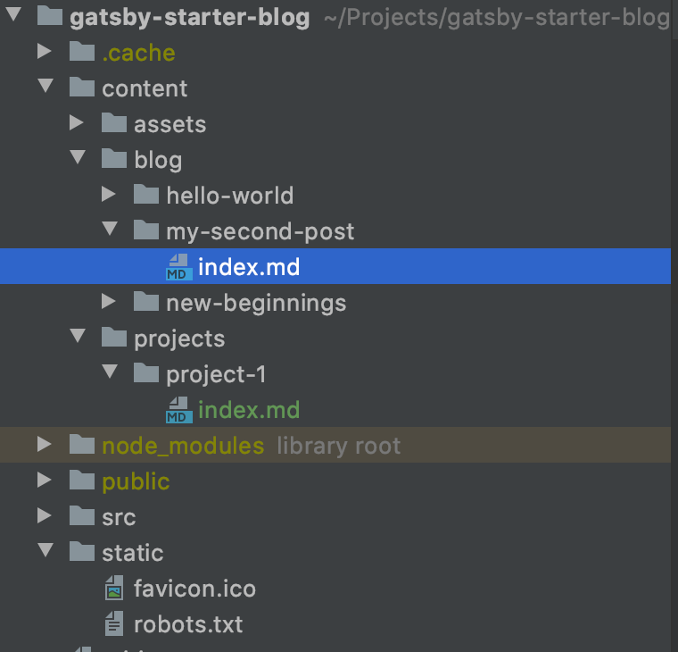
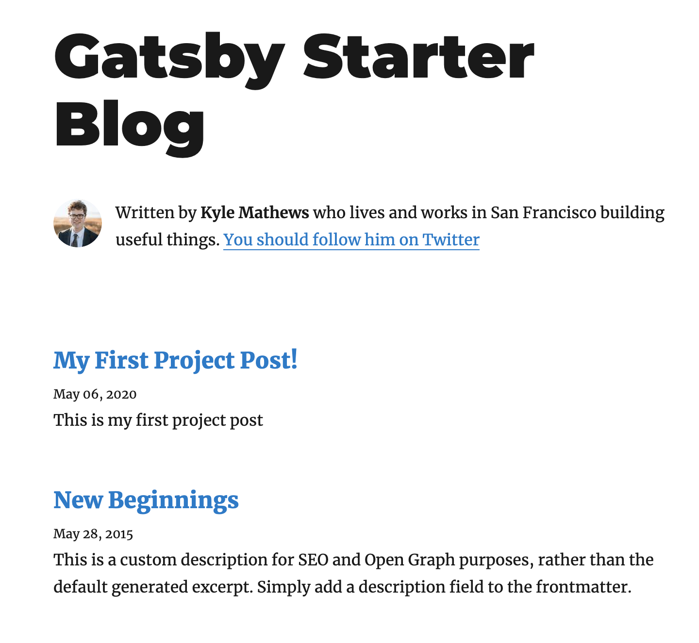
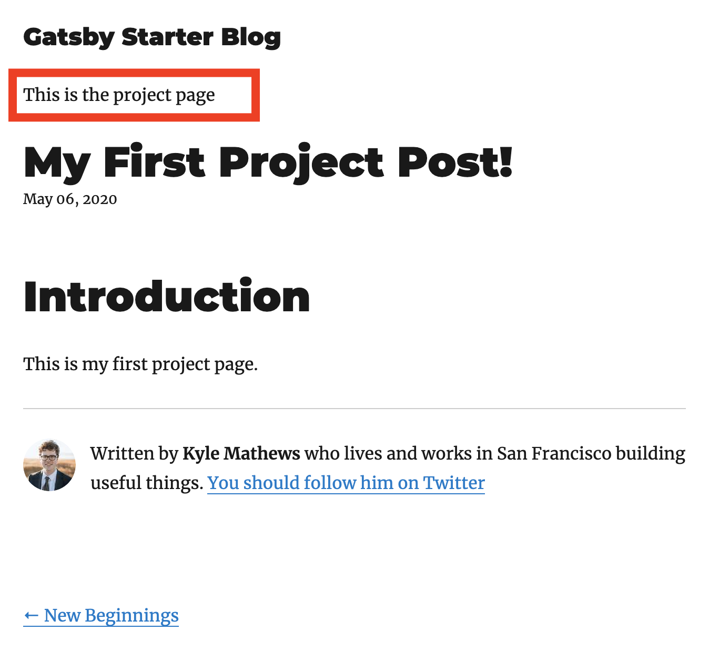

## Prerequisite

Before continuing on reading the blog, I would assume 

- You know what Gatsby is
- You know how to use Gatsby in general
- You have read [Gastby tutorials](https://www.gatsbyjs.org/tutorial/) and know how to set up a blogging site with Gatsby

If you follow the tutorials on Gatsby site, you've created a nice blogging website. However, they only introduced one template for all blog posts. 
In some cases, you might want to have different blog types for different content you write. I ran into this issue when I developed a documentation site with Gatsby for my company.
Therefore, I am going to write the solution that I've found so far.  

## Starting point

We will start with a Gatsby starter blog by running. You might need to install gatsby-cli to be able to run gatsby command.

```
gatsby new gatsby-starter-blog https://github.com/gatsbyjs/gatsby-starter-blog
```

To install dependencies, run

```
npm i
```

To start up the local development, run 
```
npm start
```

Navigate to [http://localhost:8000/](http://localhost:8000/), you will see a blog site looking like this:


<div style="text-align: center; margin: 0 auto; margin-bottom: 20px">



</div>

so, at this point, we only have one template for blog post, which is located at `src/templates/blog-post`. 
Let's say we want to a have content which we want to use a different template. Let's call it `project page`. If we want the Gatsby site to be able to consume different templates for various blog type. 

Here are what we need to do:  

- Create a new folder for different blog type
- Add source system file for new folder content in `gatsby-config` 
- Create Project Page template
- Edit `gatsby-node.js` to apply different templates for different type of blog post inside `createPage` API
- Edit Blog Post template to not query `project page` content


## 1. Create a new folder for different blog type

<div style="text-align: center; margin: 0 auto; margin-bottom: 20px">



</div>

First we need to add a projects folder and add a new post to it. The post should contain two required a title, date and description which Gatsby will query as frontmatter. 
Importantly, we need to add one more field `type` to distinguish different type of post, which we will use to tell Gatsby which template to use during build time
  

```
---
title: My First Project Post!
date: "2020-05-06T23:46:37.121Z"
description: 'This is my first project post'
post: project
---
```  

## 2. Add source system file for new folder content in `gatsby-config.js`

Next we need to tell Gatsby to source the files the `project` folder into the application, as the same way we do with the blog content

```
{
    resolve: `gatsby-source-filesystem`,
    options: {
       path: `${__dirname}/content/projects`,
        name: `projects`,
    },
}
```

## 3. Create Project Page template

Now we will create our `project-post` template so that we can use it in Gatsby `createPages`. We can just copy everything from the blog-post and rename the query `BlogPostBySlug` to `ProjectPostBySlug`.
Let's name the component `ProjectPostTemplate`. We should add a small text at the beginning to differentiate it with BlogPost. 

```js
const ProjectPostTemplate = ({ data, pageContext, location }) => {
  const post = data.markdownRemark
  const siteTitle = data.site.siteMetadata.title
  const { previous, next } = pageContext

  return (
    <Layout location={location} title={siteTitle}>
      <SEO
        title={post.frontmatter.title}
        description={post.frontmatter.description || post.excerpt}
      />
      <article>
        <header>
          // highlight-next-line
          <bold>This is the project page</bold>
          // other lines of code
        </header>

        // other lines of code
      </article>
      // other lines of code
    </Layout>
  )
}
```
 
## 4.Edit `gatsby-node.js` to apply different templates for different type of blog post inside `createPage` API

During the creating pages step, we query all the markdown to get all the nodes, each of which contains data about each blog post. We will iterate through each node and create page with `createPage` API.
To make it work for project page template, first, we need to import the template, we can put it under the blog post import

```js
const blogPost = path.resolve(`./src/templates/blog-post.js`)
// highlight-next-line
const projectPost = path.resolve(`./src/templates/project-post.js`)
```

We also need to add to GraphQL query the `type` so that we can use later in our iteration

```js
const result = await graphql(
    `
      {
        allMarkdownRemark(
          sort: { fields: [frontmatter___date], order: DESC }
          limit: 1000
        ) {
          edges {
            node {
              fields {
                slug
              }
              frontmatter {
                title
                // highlight-next-line
                type
              }
            }
          }
        }
      }
    `
  )
```
 
Now while we are looping through each node, we will have a condition based on `type` to tell Gatsby which template it should use.
If the type is `project`, we will pass `projectPost` as the value for `component` in the `createPage`. Otherwise, the default blog type is `blogPost` 

```js
posts.forEach((post, index) => {
    const previous = index === posts.length - 1 ? null : posts[index + 1].node
    const next = index === 0 ? null : posts[index - 1].node

    // highlight-start
    if (post.node.frontmatter.type === 'project') {
      createPage({
        path: post.node.fields.slug,
        component: projectPost,
        context: {
          slug: post.node.fields.slug,
          previous,
          next,
        },
      })
    } else {
      createPage({
        path: post.node.fields.slug,
        component: blogPost,
        context: {
          slug: post.node.fields.slug,
          previous,
          next,
        },
      })
    }
   // highlight-end
  })
```
At this step, the main page should have our project post(s).

<div style="text-align: center; margin: 0 auto; margin-bottom: 20px">



</div>

If we click on the first post, we will see the project template is used correctly.

<div style="text-align: center; margin: 0 auto; margin-bottom: 20px">



</div>

That is the basic of using different templates in Gatsby. 

In some use cases, you may want to separate into different queries or filter them by absolutePath so you can use these data easily in your components. For example:

```js
export const listQuery = graphql`
  query ListQuery {
    blog: allMarkdownRemark(
      sort: { order: DESC, fields: [frontmatter___date] }
      filter: {fileAbsolutePath: {regex: "/blog/*.\\md$"}}
    ) {
      edges {
        node {
          fields {
            slug
          }
          excerpt(pruneLength: 200)
          frontmatter {
            date(formatString: "MMMM Do, YYYY")
            title
            description
          }
        }
      }
    }
  }
  project: allMarkdownRemark(
    sort: { order: DESC, fields: [frontmatter___date] }
    filter: {fileAbsolutePath: {regex: "/project/*.\\md$"}}
  ) {
    edges {
      node {
        fields {
          slug
        }
        excerpt(pruneLength: 200)
        frontmatter {
          date(formatString: "MMMM Do, YYYY")
          title
          description
        }
      }
    }
  }
}
`
``` 

That's it for today! Thanks for reading. 