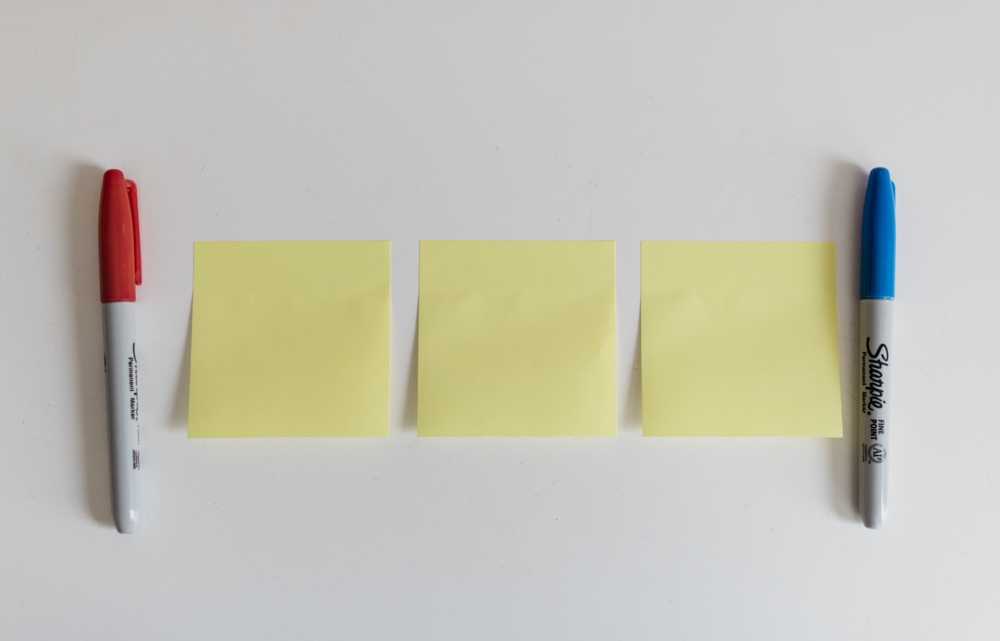

## What we want to achieve

<div style="text-align: center">
 <video autoplay="autoplay" loop="loop" width="500" height="300">
   <source src="./demo.mp4" type="video/mp4" />
   
   </video>
</div>

There are a few ways to make the header stick to the view.
In this tutorial, I will show you some solutions that I found.

## Using CSS

The most straightforward way is to use css <a rel="noopener" href="https://developer.mozilla.org/en-US/docs/Web/CSS/position" target="_blank">position: sticky</a> position.
This css attribute enables us to stick an element to the viewport

Let's say we have our html as below

```html
<div class="app-container">
  <header class="app-header">
    header
  </header>
  <div class="content">
    <p>
      Lorem ipsum dolor sit amet, consectetur adipiscing elit. Pellentesque
      imperdiet ac est vitae convallis. Mauris sed neque ac metus pretium
      fermentum non sit amet lacus. Donec tristique erat at nunc blandit
      interdum. Vestibulum imperdiet libero ac sapien tempus ultricies. Cras et
      arcu ut nunc faucibus efficitur facilisis nec lorem. Duis ac placerat
      tortor. In nibh ex, tristique id malesuada vel, pharetra non turpis.
    </p>
    <p>
      Etiam tempus lorem dui, eget placerat massa blandit et. Aliquam erat
      volutpat. Mauris fringilla blandit congue. Pellentesque imperdiet mauris
      et eros tempor ultrices. Cras eu aliquet magna. Pellentesque at placerat
      ex. Morbi condimentum tincidunt urna, vel elementum lorem efficitur nec.
      Pellentesque venenatis feugiat nibh non malesuada. Ut id aliquet nulla.
      Aenean magna massa, ornare in diam sit amet, congue consequat tortor. Sed
      venenatis congue nisl, sed eleifend nibh molestie eu.
    </p>
    <p>
      Orci varius natoque penatibus et magnis dis parturient montes, nascetur
      ridiculus mus. Donec consequat odio sed neque semper, eget rutrum sapien
      ornare. Nunc eget varius tortor. Vestibulum iaculis diam a risus volutpat
      accumsan. Maecenas sit amet imperdiet leo. Aenean eleifend interdum
      pulvinar. Vestibulum lobortis ligula ut eros consectetur, a sollicitudin
      mi mattis. Donec gravida velit ut nisl mattis hendrerit. In at facilisis
      metus. Curabitur gravida ipsum eget urna lacinia euismod. Etiam in lorem
      facilisis enim tempus auctor. Curabitur eget massa risus. Ut elementum sem
      dictum tellus mollis pulvinar. Duis rhoncus turpis a magna dapibus
      pellentesque. Mauris bibendum eu nulla sit amet sodales. Fusce eget
      sodales purus.
    </p>
    <!-- another long content        -->
  </div>
</div>
```

and css

```css
.app-container {
  margin: 0 auto;
  max-width: 750px;
}

.app-header {
  background-color: #282c34;
  min-height: 50px;
  max-width: 750px;
  width: 100%;
  display: flex;
  flex-direction: column;
  align-items: center;
  justify-content: center;
  font-size: calc(10px + 2vmin);
  color: white;
}
```

To make our header stick to our view, we can specify our header like this:

```css
.app-header {
  position: -webkit-sticky; /* Safari */
  position: sticky;
  top: 0;
  /* other properties */
}
```

As MDN explains:

> Sticky positioning can be thought of as a hybrid of relative and fixed positioning.
> A stickily positioned element is treated as relatively positioned until it crosses a specified threshold, at which point it is treated as fixed until it reaches the boundary of its parent.

This means that the css value will act as `position: relative` within its parents until it reaches a specific threshold.
In our example, the header will stay relative to our container until we start scrolling. That is because we specified our threshold at `top: 0`.
To illustrate it clearer, let's make our header sticky at `top: 20px` and give some content above the header. Now it would look like this:

<div style="text-align: center">
  <video autoplay="autoplay" loop="loop" width="600" height="400">
     <source src="./demo1.mp4" type="video/mp4" />
     
  </video>
</div>

Pretty neat and simple right? However, the support for this value is quite poor. See <a rel="noopener href="https://caniuse.com/#search=sticky" target="\_blank">caniuse</a> for more info.
To make it work across browsers, we need to apply Polyfill to make it work well with a wide range of browsers.

## Using JS and CSS

If you are not a fan of the above solution and want to find a more stable cross-browsers solution, we can use `position: fixed`
to position our header when we scroll down, but we need an assistance of JS to make it happen.

Basically, what we are trying to do here is that we will detect whether users scroll away from the top and decide when to attach the `position: fixed` to our header.
By this way, our header will not be out of the view and stick at the top.
Let's create a class `sticky` to make it easy to add in JS.

```css
.sticky {
  position: fixed;
  top: 0;
}
```

In JS, we will listen to sroll event of the page by using `onscroll`

```javascript
const header = document.querySelector('header')
const topOfHeader = header.offsetTop

window.addEventListener('scroll', () => {
  if (window.pageYOffset > topOfHeader) {
    header.classList.add('sticky')
  } else {
    header.classList.remove('sticky')
  }
})
```

- `offsetTop` will return the <a rel="noopener" href="https://www.w3schools.com/jsref/prop_element_offsettop.asp" target="_blank">top position (in pixels) relative to the top of the offsetParent element</a>.
  In our case, it will return the top position of the header relative to the `app-container`, which is also counting from the top of our viewport.
- `window.pageYOffset` will return the number indicating how far we have scrolled long the horizontal axis.

This works pretty well so far, but there is one bugging issue. When we our header become `fixed`, the content jumps up abruptly. This is because when we apply `position: fixed` to the header, it is no longer taking up space in the document.
Therefore, the section will jump up to take up the exact height of the header.
You can see the demo in this <a rel="noopener" href="https://codepen.io/Dragonza/pen/oRKmVj?editors=1111" target="_blank">pen</a>

To fix this, we need to add a padding top to the parent element the same value as the height of our header
and reset it when we scroll back to the top.

```javascript
const header = document.querySelector('header')
const container = document.querySelector('.app-container')
const topOfHeader = header.offsetTop

window.addEventListener('scroll', () => {
  if (window.pageYOffset > topOfHeader) {
    // highlight-next-line
    container.style.paddingTop = header.offsetHeight + 'px'
    header.classList.add('sticky')
  } else {
    // highlight-next-line
    container.style.paddingTop = 0
    header.classList.remove('sticky')
  }
})
```

- `offsetHeight` will return the height of an element including vertical padding and borders, as an integer

You can see full demo at this <a rel="noopener" href="https://codepen.io/Dragonza/pen/oRKVKo?editors=1111" target="_blank">pen</a>

That is it! Thank you for taking time reading this blog!

<hr />
