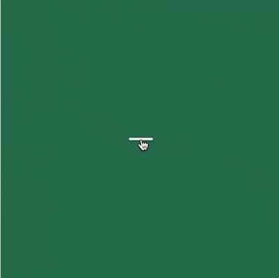
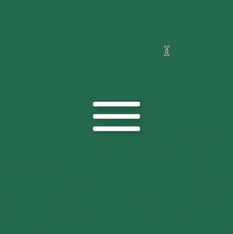

<br />

In this blog, you will learn how to create an animated hamburger icon when being hovered over by using Pure CSS.

##Demo
<div style="text-align: center">
    
</div>
## Implementation

### Initial styling

Firstly, let's create the html

```html
<div class="container">
  <div class="menu-icon">
    <div class="line line-1"></div>
    <div class="line line-2"></div>
    <div class="line line-3"></div>
  </div>
</div>
```

Next is the css for initial styling.
To make things organized, scss is used to be able to declare some reusable variables.

We will use flexbox to place the container in the middle of our screen.
Keep in mind that to make it work,
we need to set the height and weight of the body tag too since body tag is the container of our container div.
In this case, we could set it to 100% of height and width of the viewport.

```scss
$container-size: 400px;
$container-bg: #3faf82;

$line-space: 13px;
$line-height: 8px;
$line-width: 80px;

body {
  display: flex;
  justify-content: center;
  align-items: center;
  width: 100vw;
  height: 100vh;
}

.container {
  box-shadow: 1px 2px 10px 0px rgba(0, 0, 0, 0.3);
  background: darken($container-bg, 15%);
  display: flex;
  justify-content: center;
  align-items: center;
  width: $container-size;
  height: $container-size;
}

.line {
  width: $line-width;
  height: 8px;
  position: relative;
  background-color: #fff;
  border-radius: 3px;
  box-shadow: 0 2px 10px 0 rgba(0, 0, 0, 0.3);
}

.line-1 {
  margin-bottom: $line-space;
}

.line-3 {
  margin-top: $line-space;
}
```

### Animate the icon with <a href="https://www.w3schools.com/css/css3_transitions.asp" target="_blank">transition</a>

What we want to achieve is to make the second line disappear,
the first and third lines move to the center and rotate 45deg and 135deg respectively. In this case,
we can use `transition` to create the animation effect. This selector comes with a few properties in terms of effect, timing, delay and duration, which allows us
to create smooth effect.

To begin with, let's make the second line shrink in and disappear.
We can achieve that by using scale and transform.
Also, let's make the transition time into a variable to make it easier to reuse later

```scss
$transition-time: 0.2s;

.line-2 {
  transition: all ease $transition-time;
  transform: scale(1);
}

.menu-icon:hover {
  .line-2 {
    transform: scale(0);
  }
}
```

Here is what we got

<div style="text-align: center">
    
</div>

<br />

Next, let's move to line-1 and line-3. In general, these two lines share the same behaviors but with small difference in styling.
They both need to have two actions which are moving to line-2's place and rotating at a certain degree.
We can use two css selectors to make it happen. The first is `top/botttom` to shift them to center of the icon and
use `transform: rotate` to perform the later.

The distance to move line-1 and line-3 to line-2 is equal the total of `line-height` and `line-space`.
We can declare it into a variable called `line-offsetY`.

```scss
$line-offsetY: $line-height + $line-space;

.menu-icon:hover {
  // highlight-start
  .line-1 {
    top: $line-offsetY;
  }
  // highlight-end

  .line-2 {
    transform: scale(0);
  }

  // highlight-start
  .line-3 {
    bottom: $line-offsetY;
  }
  // highlight-end
}
```

For `transition` to work out for `top/bottom`, we have to declare such properties in their un-hovered state as well.

```scss
.line-1 {
  // highlight-next-line
  top: 0;
  margin-bottom: $line-space;
  transition: top $transition-time ease;
}

.line-3 {
  // highlight-next-line
  bottom: 0;
  margin-top: $line-space;
  transition: bottom $transition-time ease;
}
```

<div style="text-align: center">
 
</div>

Look promising! Now we can focus on making it rotate.
There is a tricky part here. The rotation happens after the shifting on the forwards transition, but it would happen before
the shifting on backward transition. This is known as `reversed transition`. Luckily, `transition` allows us to create effect with specific selectors
and also have a property what allows us to declare the delay of the movement.
Hence, we need to declare `transition` in both un-hover and hover state with a suitable delay time. Enough with the writing, let's jump to the coding part

We add the rotate for line-1 and line-3 with `transform: rotate`

```scss
.menu-icon:hover {
  .line-1 {
    top: $line-offsetY;
    // highlight-next-line
    transform: rotate(45deg);
  }

  .line-2 {
    transform: scale(0);
  }

  .line-3 {
    bottom: $line-offsetY;
    // highlight-next-line
    transform: rotate(135deg);
  }
}
```

Next, we will add transition for both states of the lines.
A variable called `$transition-delay` is created for reusability

```scss
$transition-delay: 0.5s;

.line-1 {
  top: 0;
  margin-bottom: $line-space;
  // highlight-start
  transition: top $transition-time ease $transition-delay, transform
      $transition-time ease;
  // highlight-end
}

.line-3 {
  bottom: 0;
  margin-top: $line-space;
  // highlight-start
  transition: bottom $transition-time ease $transition-delay, transform
      $transition-time ease;
  // highlight-end
}

.menu-icon:hover {
  .line-1 {
    top: $line-offsetY;
    transform: rotate(45deg);
    // highlight-start
    transition: top $transition-time ease, transform $transition-time ease
        $transition-delay;
    // highlight-end
  }

  .line-2 {
    transform: scale(0);
  }

  .line-3 {
    bottom: $line-offsetY;
    transform: rotate(135deg);
    // highlight-start
    transition: bottom $transition-time ease, transform $transition-time ease
        $transition-delay;
    // highlight-end
  }
}
```

The key here is to know where to put the `transition-delay`.
Since we want the lines to rotate after the shift while the icon is being hovered, we need
to declare the delay for `transform` in the hover state. When we un-hover the icon, the rotation would go before the lines shift back to their initial position,
we would need to delay the `top/bottom` in their initial state.

This challenge has given me a hard time to figure it out that because I would typically
use `transition` for the initial state and never think about it. It took me a few hours to have an aha moment but it was interesting to learn.
You can see the demo with the code <a href="https://codepen.io/Dragonza/pen/NZLzPB?editors=0100">here</a>.

If you are not a fan of `transition`, you can also use `animation` selector to create the same result.

This is a challenge I found from <a href="https://100dayscss.com/?dayIndex=1">100dayscsschallenge</a>. Give it a try if you want to level up your css skills.

That's it! Thank you for taking your time to read the blog.
