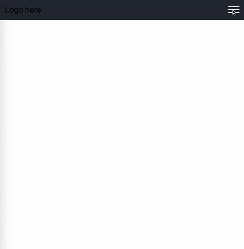
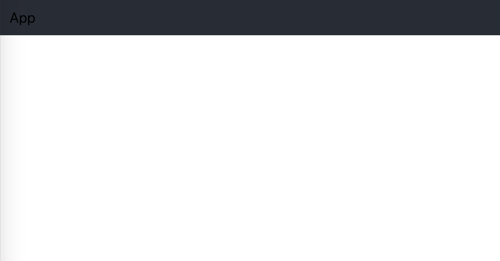
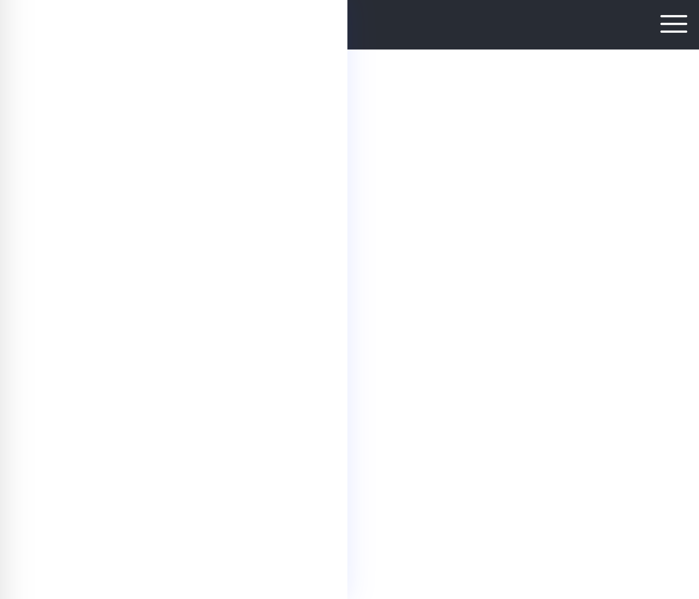
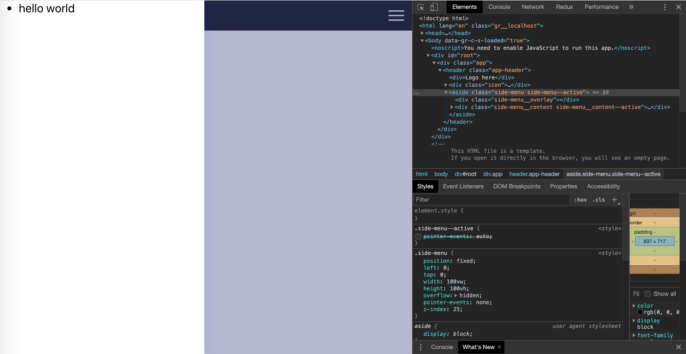

In today's tutorial, I will show you how to create a side menu component using React and CSS

# Demo

<div style="text-align: center">
    
</div>

What we want to create in this tutorial is a `SideMenu` will slide from the left of our page when users click on the hamburger icon.
The menu would slide back to the left if users click on the overlay outside of the component

# Implementation

Let's create a React by using `create-react-app`

## Initialize the project

```
npx create-react-app sidemenu-component
```

After that, run `npm start` to boost up the project and you will have a working React project set up for you.

In your project, you will have `App.js` and `App.css` as our main component and its styling. Let's remove all the unwanted css and jsx. `App.js` will look like this

```js
// App.js
import React from 'react'

function App() {
  return (
    <div className="app">
      <header className="app-header">App header</header>
    </div>
  )
}

export default App
```

In the `App.css`, we can remove everything except for the App-header. I changed it to `app-header` to make it consistent with other classes.

Our page will look like this:

<div style="text-align: center">
    
</div>

<br />

## Creating SideMenu and basic styling

Now, let's create the SideMenu Component.

```javascript
// SideMenu.js
import React, { Component } from 'react'

class SideMenu extends Component {
  render() {
    return (
      <aside className="side-menu">
        <div className="side-menu__overlay" />
        <div className="side-menu__content">Side bar</div>
      </aside>
    )
  }
}

export default SideMenu
```

We will have a div inside our SideMenu to act as an overlay for our SideMenu.

Next, here are some basic styling to our SideMenu Component

```css
/*App.css*/

.side-menu {
  position: fixed;
  left: 0;
  top: 0;
  width: 100%;
  height: 100%;
  overflow: hidden;
  pointer-events: none;
  z-index: 25;
}

.side-menu__content {
  box-sizing: border-box;
  position: relative;
  top: 0;
  left: 0;
  z-index: 10;
  height: 100%;
  width: 70%;
  max-width: 26rem;
  background-color: #fff;
  box-shadow: 0 0 2rem rgba(0, 0, 255, 0.1);
}

.side-menu__overlay {
  position: absolute;
  display: block;
  top: 0;
  left: 0;
  height: 100%;
  width: 100%;
  background-color: #0c1066;
  opacity: 0.3;
}
```

It is very straightforwards. The SideMenu expand whole view width and height with a fixed position while the content will take up about 70% and has a fix number of max-width.
The overlay will take up 100% of width and height of its parent and have an opacity of 0 when the menu is not active. It will have a non-zero opacity when the menu is active.

Don't forget to have `pointer-events: none;` on the `side-menu`. Let's just leave it there for now. I will explain more about that later on.

## Icon Component

The SideMenu will show up when we click on the icon and it will take `fill` and `onMenuClick` as props.
I am using a svg, you can use whatever element you wish as long as it has a click event.

```javascript
// Hamburger.js
import React from 'react'

function Hamburger({ fill = '#594e78', onMenuClick }) {
  return (
    <svg
      onClick={onMenuClick}
      id="Menu_Burger_Icon"
      data-name="Menu Burger Icon"
      viewBox="31.5 30 49.9 32"
      fill={fill}
    >
      <rect
        id="Rectangle_9"
        width="49.9"
        height="4"
        className="hamburger__icon__fill"
        data-name="Rectangle 9"
        rx="2"
        transform="translate(31.5 58)"
      />
      <rect
        id="Rectangle_10"
        width="49.9"
        height="4"
        className="hamburger__icon__fill"
        data-name="Rectangle 10"
        rx="2"
        transform="translate(31.5 44)"
      />
      <rect
        id="Rectangle_11"
        width="49.9"
        height="4"
        className="hamburger__icon__fill"
        data-name="Rectangle 11"
        rx="2"
        transform="translate(31.5 30)"
      />
    </svg>
  )
}

export default Hamburger
```

(the source code of svg above is from <a href="https://github.com/hamedbaatour/minimus/blob/master/src/app/app.component.html#L33" target="_blank">here</a>. It was written for an Angular project but I modified it a bit to fit a React project)

## Putting all together

We can add these two components to our main `App.js` file. The main idea is to make the icon a toggle button.
This means that our App component will have a state called `isMenuActive` to keep track of SideMenu Component active state.
As `App.js` was created as a stateless component, we can use React Hook <a href="https://reactjs.org/docs/hooks-state.html" target="_blank">useState</a> to avoid rewriting our component.

If you are not familiar with React Hook, I suggest you go to the website and have a quick read about `useState`. It is a very straightforward and short read.

```javascript
import React, { useState } from 'react'
import './App.css'
import Hamburger from './Hamburger'
import SideMenu from './SideMenu'

function App() {
  const [isMenuActive, activeMenu] = useState(false)

  return (
    <div className="app">
      <header className="app-header">
        <div>Logo here</div>
        <div className="icon">
          <Hamburger
            fill="#fff"
            onMenuClick={() => activeMenu(!isMenuActive)}
          />
        </div>
        <SideMenu isMenuActive={isMenuActive} />
      </header>
    </div>
  )
}

export default App
```

The initial state for `isMenuActive` is false. Right now, the SideMenu won't be visible. let's set it to `true` to make sure our components are rendered properly.
`activeMenu` will be our callback function to set SideMenu active state. It will set state to the opposite state whenever the icon is clicked.

Here is what we have got:

<div style="text-align: center">
    
</div>
<br />

Now, we need to make our SideMenu Component to be aware of `isMenuActive` and when the overlay is clicked, so we will pass `isMenuActive` and `onOverLayClick` as props.

```javascript
import React, { useState } from 'react'
import './App.css'
import Hamburger from './Hamburger'
import SideMenu from './SideMenu'

function App() {
  const [isMenuActive, activeMenu] = useState(false)

  return (
    <div className="app">
      <header className="app-header">
        <div>Logo here</div>
        <div className="icon">
          <Hamburger
            fill="#fff"
            onMenuClick={() => activeMenu(!isMenuActive)}
          />
        </div>
        <SideMenu
          isMenuActive={isMenuActive}
          // highlight-next-line
          onOverLayClick={() => activeMenu(!isMenuActive)}
        />
      </header>
    </div>
  )
}

export default App
```

When the menu is active, the `side-menu` and `side-menu__content` would have new active classes which are `side-menu--active` and `side-menu__content--active`.
We also will need to bind the `onOverLayClick` to `onClick` handler.
I am using a library called <a href="https://github.com/JedWatson/classnames" target="_blank">classnames</a> to make it easier to manage class names.

```javascript
// SideMenu.js
import React, { Component } from 'react'
import classnames from 'classnames'
import PropTypes from 'prop-types'

class SideMenu extends Component {
  render() {
    const { isMenuActive, onOverLayClick } = this.props

    // highlight-start
    const sideMenuClasses = classnames('side-menu', {
      'side-menu--active': isMenuActive,
    })
    const sideMenuContentClasses = classnames('side-menu__content', {
      'side-menu__content--active': isMenuActive,
    })
    // highlight-end

    return (
      // highlight-next-line
      <aside className={sideMenuClasses}>
        // highlight-next-line
        <div className="side-menu__overlay" onClick={onOverLayClick} />
        // highlight-next-line
        <div className={sideMenuContentClasses}>
          Side bar
        </div>
      </aside>
    )
  }
}
```
Below is what we have got so far: 

<div style="text-align: center">
    
</div>
<br />

## Making the SideMenu reusable
To make the `SideMenu` flexible and reusable, we can pass the content as a child prop from `App.js`.

```javascript
// App.js

function App() {
  const [isMenuActive, activeMenu] = useState(true);

  return (
    <div className="app">
      <header className="app-header">
        // Omit some lines
        <SideMenu
          isMenuActive={isMenuActive}
          onOverLayClick={() => activeMenu(!isMenuActive)}
        >
          // highlight-start
          <ul>
            <li>hello world</li>
          </ul>
          // highlight-end
        </SideMenu>
      </header>
    </div>
  );
}
```
The SideMenu will render children as prop.

```javascript
import React from 'react'

class SideMenu extends Component {
  render() {
   // omit some lines
    return (
      <aside className={sideMenuClasses}>
        <div className="side-menu__overlay" onClick={onOverLayClick}/>
        <div className={sideMenuContentClasses}>
          // highlight-next-line
          {children}
        </div>
      </aside>
    );
  }
}
```

By doing, we can reuse this component to different projects without modifying it directly.

## Adding CSS for animation

That is all we need on React side, the final step is to make use of CSS animation magic.
In this case, there are three properties we need to pay attention to. 

- First, we will use `transition` to create the animation effect.
- Next, to make the `side-menu__content` move in and out of our web page from the left, we will make use of `transform: translateX()`. 
- Finally, last but not least, we will have to use `pointer-events: auto` on our `side-menu` so that the overlay can work as expected. 
 
Let's modify our css code a little bit
```css
.side-menu__content {
  box-sizing: border-box;
  position: relative;
  top: 0;
  left: 0;
  z-index: 10;
  height: 100%;
  width: 70%;
  max-width: 26rem;
  background-color: #fff;
  box-shadow: 0 0 2rem rgba(0, 0, 255, 0.1);
  // highlight-next-line
  transform: translateX(-103%);
  // highlight-next-line
  transition: transform 300ms linear;
}

.side-menu__content--active {
  // highlight-next-line
  transform: none;
}

.side-menu__overlay {
  position: absolute;
  display: block;
  top: 0;
  left: 0;
  height: 100%;
  width: 100%;
  background-color: #0c1066;
  // highlight-next-line
  opacity: 0;
  // highlight-next-line
  transition: opacity 300ms linear;
}

.side-menu--active {
  // highlight-next-line
  pointer-events: auto;
}

.side-menu--active .side-menu__overlay {
  // highlight-next-line
  opacity: 0.3;
}
```

Since the initial state of our menu is inactive, we set the value of `translateX` to -100% to keep the `side-menu__content` our of our view. 
When the menu is active, we turn off the `transform` so the content can slide into our view.
We want `transition` to be only effective on the `transform` at 300ms and linear speed. 

The same method is applied to the `overlay`, but with `opacity` instead. The `overlay` will have an opacity of 0 when the menu inactive and is given a non-zero opacity when the menu is active.

Remember that we set the `side-menu` to have a width and height of our screen view, even though the component is out of the view, it still exists in the DOM.
That is why we need to have `pointer-events: none;` at the beginning to prevent all clicks, state and cursor options on the SideMenu.
Therefore, when the menu is active, we need to enable that option back so that the component would respond to any touch/mouse event.

That's it! Thank you for taking your time to read the blog. :)
