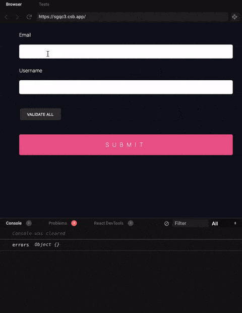

Recently, I've been using [react-hook-form](https://github.com/react-hook-form/react-hook-form) to create a login form. 
The library has a lot of [examples](https://github.com/react-hook-form/react-hook-form/tree/master/examples) in their github page. 
However, I could not find a case for my use. I wanted to use `debounce` on inputChange to avoid trigger validation on every keystroke from users. 
It took me a couple of days to get the result. Therefore, I decided to write this blog to share with anyone who wants to implement the same behavior

The version of `react-form-hook` mentioned in this blog is version 6. 

## Basic use of react-hook-form
The code below show you a basic usage. The code is from [here](https://react-hook-form.com/get-started).

```javascript
import React from "react";
import { useForm } from "react-hook-form";

const Example = () => {
  // highlight-start
  const { handleSubmit, register, errors } = useForm();
  const onSubmit = values => console.log(values);
  // highlight-end

  return (
    // highlight-next-line
    <form onSubmit={handleSubmit(onSubmit)}>
      <input
        name="email"
        // highlight-start
        ref={register({
          required: "Required",
          pattern: {
            value: /^[A-Z0-9._%+-]+@[A-Z0-9.-]+\.[A-Z]{2,}$/i,
            message: "invalid email address"
          }
        })}
        // highlight-end
      />
      {errors.email && errors.email.message}

      <input
        name="username"
        // highlight-start
        ref={register({
          validate: value => value !== "admin" || "Nice try!"
        })}
        // highlight-end
      />
      {errors.username && errors.username.message}

      <button type="submit">Submit</button>
    </form>
  );
};
``` 

## Adding onChange handler for input fields

```javascript
import React from "react";
import { useForm } from "react-hook-form";

const Example = () => {
  const { handleSubmit, register, errors } = useForm();
  const onSubmit = values => console.log(values);

  return (
    <form onSubmit={handleSubmit(onSubmit)}>
      <input
        name="email"
        ref={register({
          required: "Required",
          pattern: {
            value: /^[A-Z0-9._%+-]+@[A-Z0-9.-]+\.[A-Z]{2,}$/i,
            message: "invalid email address"
          }
        })}
        // highlight-next-line
        onChange={() => console.log('email input changed')}
      />
      {errors.email && errors.email.message}

      <input
        name="username"
        ref={register({
          validate: value => value !== "admin" || "Nice try!"
        })}
        // highlight-next-line
        onChange={() => console.log('user input changed')}
      />
      {errors.username && errors.username.message}

      <button type="submit">Submit</button>
    </form>
  );
};
```

<div style="text-align: center; margin: 0 auto; margin-bottom: 20px">
    
</div>
 

At this point, using [debounce](https://davidwalsh.name/javascript-debounce-function) to only fire the callback after a certain amount of time is one of the good ways to improve client-side performance.
You can write a simple function to use, or you can install a small [debounce](https://github.com/component/debounce#readme) package which I prefer.
The [debounce]() function will take a function as the first argument, and a wait time as the second argument.

```javascript
import React from "react";
import { useForm } from "react-hook-form";
// highlight-next-line
import debounce from "debounce";

const Example = () => {
  const { handleSubmit, register, errors } = useForm();
  const onSubmit = values => console.log(values);

  return (
    <form onSubmit={handleSubmit(onSubmit)}>
      <input
        name="email"
        ref={register({
          required: "Required",
          pattern: {
            value: /^[A-Z0-9._%+-]+@[A-Z0-9.-]+\.[A-Z]{2,}$/i,
            message: "invalid email address"
          }
        })}
        // highlight-next-line
        onChange={debounce(() => console.log('email input changed'), 500)}
      />
      {errors.email && errors.email.message}

      <input
        name="username"
        ref={register({
          validate: value => value !== "admin" || "Nice try!"
        })}
        // highlight-next-line
        onChange={debounce(() => console.log('user input changed'), 500)}
      />
      {errors.username && errors.username.message}

      <button type="submit">Submit</button>
    </form>
  );
};
```

Now, the callback only triggers when users stop typing more than 500ms

<div style="text-align: center; margin: 0 auto; margin-bottom: 20px">
    
</div>

## Trigger validation
By default, `react-form-hook` will trigger validation automatically based on our choide of `mode`, 
but the library also exposes [trigger](https://react-hook-form.com/api/#trigger) API where you can trigger the validation manually. 
In our case, that is what we are going to use in our onChange handlers. Since the function returns a Promise, we need to use `async/await` for the callback functions.


```javascript
import React from "react";
import { useForm } from "react-hook-form";
// highlight-next-line
import debounce from "debounce";

const Example = () => {
  const { handleSubmit, register, errors, trigger } = useForm();
  const onSubmit = values => console.log(values);

  return (
    <form onSubmit={handleSubmit(onSubmit)}>
      <input
        name="email"
        ref={register({
          required: "Required",
          pattern: {
            value: /^[A-Z0-9._%+-]+@[A-Z0-9.-]+\.[A-Z]{2,}$/i,
            message: "invalid email address"
          }
        })}
        // highlight-start
        onChange={debounce( async () => {
          await trigger('email')
        }, 500)}
        // highlight-end
      />
      {errors.email && errors.email.message}

      <input
        name="username"
        ref={register({
          validate: value => value !== "admin" || "Nice try!"
        })}
        // highlight-start
        onChange={debounce( async () => {
          await trigger('username')
        }, 500)}
        // highlight-end
      />
      {errors.username && errors.username.message}

      <button type="submit">Submit</button>
    </form>
  );
};
```


## FAQ

1. Why can't you use `onChange` mode in `useForm`?


## Final code sample
<div>
<iframe src="https://codesandbox.io/embed/react-hook-form-debounce-onchange-forked-jid6p?fontsize=14&hidenavigation=1&theme=dark"
     style="width:100%; height:500px; border:0; border-radius: 4px; overflow:hidden;"
     title="React Hook  Form -  Debounce onChange (forked)"
     allow="accelerometer; ambient-light-sensor; camera; encrypted-media; geolocation; gyroscope; hid; microphone; midi; payment; usb; vr; xr-spatial-tracking"
     sandbox="allow-forms allow-modals allow-popups allow-presentation allow-same-origin allow-scripts"
   />
</div>
