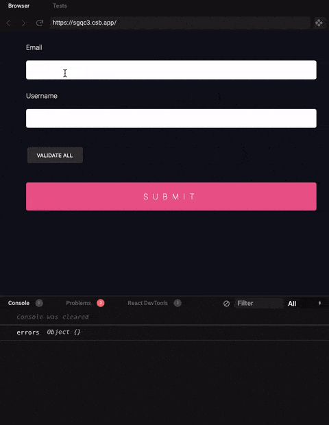
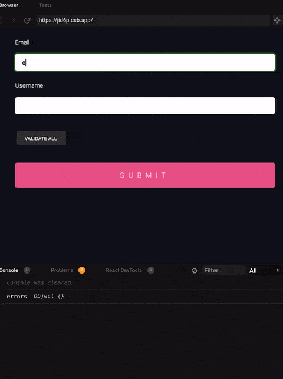

Recently, I've been using [react-hook-form](https://github.com/react-hook-form/react-hook-form) to create a login form.
The library has a lot of [examples](https://github.com/react-hook-form/react-hook-form/tree/master/examples) on the github page.
However, I could not find a case for my use. I wanted to use `debounce` on inputChange to avoid trigger validation on every keystroke from users.
It took me a couple of days to get the result. Therefore, I decided to write this blog to share with anyone who wants to implement the same behavior

The version of `react-form-hook` mentioned in this blog is version 6.

## Basic use of react-hook-form

The code below shows you the basic usage. The code is from [here](https://react-hook-form.com/get-started).

```javascript
import React from 'react'
import { useForm } from 'react-hook-form'

const Example = () => {
    // highlight-start
    const { handleSubmit, register, errors } = useForm()
    const onSubmit = (values) => console.log(values)
    // highlight-end

    return (
        // highlight-next-line
        <form onSubmit={handleSubmit(onSubmit)}>
            <input
                name="email"
                // highlight-start
                ref={register({
                    required: 'Required',
                    pattern: {
                        value: /^[A-Z0-9._%+-]+@[A-Z0-9.-]+\.[A-Z]{2,}$/i,
                        message: 'invalid email address',
                    },
                })}
                // highlight-end
            />
            {errors.email && <p>{errors.email.message}</p>}

            <input
                name="username"
                // highlight-start
                ref={register({
                    validate: (value) => value.length > 5,
                })}
                // highlight-end
            />
            {errors.username && errors.username.message}

            <button type="submit">Submit</button>
        </form>
    )
}
```

## Adding onChange handler for input fields

```javascript
import React from 'react'
import { useForm } from 'react-hook-form'

const Example = () => {
    const { handleSubmit, register, errors } = useForm()
    const onSubmit = (values) => console.log(values)

    return (
        <form onSubmit={handleSubmit(onSubmit)}>
            <input
                name="email"
                ref={register({
                    required: 'Required',
                    pattern: {
                        value: /^[A-Z0-9._%+-]+@[A-Z0-9.-]+\.[A-Z]{2,}$/i,
                        message: 'invalid email address',
                    },
                })}
                // highlight-next-line
                onChange={() => console.log('email input changed')}
            />
            {errors.email && <p>{errors.email.message}</p>}

            <input
                name="username"
                ref={register({
                    validate: (value) => value.length > 5,
                })}
                // highlight-next-line
                onChange={() => console.log('user input changed')}
            />
            {errors.username && errors.username.message}

            <button type="submit">Submit</button>
        </form>
    )
}
```



At this point, using [debounce](https://davidwalsh.name/javascript-debounce-function) to only fire the callback after a certain amount of time is one of the good ways to improve client-side performance.
You can write a simple function to use, or you can install a small [debounce](https://github.com/component/debounce#readme) package which I prefer.
This function will take a function as the first argument, and a wait time as the second argument.

```javascript
import React from 'react'
import { useForm } from 'react-hook-form'
// highlight-next-line
import debounce from 'debounce'

const Example = () => {
    const { handleSubmit, register, errors } = useForm()
    const onSubmit = (values) => console.log(values)

    return (
        <form onSubmit={handleSubmit(onSubmit)}>
            <input
                name="email"
                ref={register({
                    required: 'Required',
                    pattern: {
                        value: /^[A-Z0-9._%+-]+@[A-Z0-9.-]+\.[A-Z]{2,}$/i,
                        message: 'invalid email address',
                    },
                })}
                // highlight-next-line
                onChange={debounce(
                    () => console.log('email input changed'),
                    500
                )}
            />
            {errors.email && <p>{errors.email.message}</p>}

            <input
                name="username"
                ref={register({
                    validate: (value) => value.length > 5,
                })}
                // highlight-next-line
                onChange={debounce(
                    () => console.log('user input changed'),
                    500
                )}
            />
            {errors.username && errors.username.message}

            <button type="submit">Submit</button>
        </form>
    )
}
```

Now, the callback only triggers when users stop typing more than 500ms



## Trigger validation

By default, `react-form-hook` will trigger validation automatically based on our choice of `mode`,
but the library also exposes [trigger](https://react-hook-form.com/api/#trigger) API where you can trigger the validation manually.
In our case, that is what we are going to use in our onChange handlers. Since the function returns a Promise, we need to use `async/await` for the callback functions.

```javascript
import React from 'react'
import { useForm } from 'react-hook-form'
// highlight-next-line
import debounce from 'debounce'

const Example = () => {
    const { handleSubmit, register, errors, trigger } = useForm()
    const onSubmit = (values) => console.log(values)

    return (
        <form onSubmit={handleSubmit(onSubmit)}>
            <input
                name="email"
                ref={register({
                    required: 'Required',
                    pattern: {
                        value: /^[A-Z0-9._%+-]+@[A-Z0-9.-]+\.[A-Z]{2,}$/i,
                        message: 'invalid email address',
                    },
                })}
                // highlight-start
                onChange={debounce(async () => {
                    await trigger('email')
                }, 500)}
                // highlight-end
            />
            {errors.email && <p>{errors.email.message}</p>}

            <input
                name="username"
                ref={register({
                    validate: (value) => value.length > 5,
                })}
                // highlight-start
                onChange={debounce(async () => {
                    await trigger('username')
                }, 500)}
                // highlight-end
            />
            {errors.username && errors.username.message}

            <button type="submit">Submit</button>
        </form>
    )
}
```

### Why don't we use`onChange` mode in `useForm`?

`react-hook-form` has the `onChange` mode which will automatically trigger validation when there is a change in the input fields. For some reason, it only triggers the debounce function, but the validation won't work.
I've tried that approach when I wanted to have the debounce effect on inputs, but it does not trigger the validation as I thought it would be. The function we passed to the debounce would trigger,
but the validation functions did not work.
I've gone down that path for a few days before I took another approach with the manual `trigger` API.

## Bonus: How to disable the submit button when there are one or more invalid fields

We need to have an object state to keep track of whether each field is valid or not, and then we have a variable to keep an eye on all the fields  
To know if all properties in an object are truthy, we can use javascript [Object.keys](https://developer.mozilla.org/en/docs/Web/JavaScript/Reference/Global_Objects/Object/keys) and [every](https://developer.mozilla.org/en-US/docs/Web/JavaScript/Reference/Global_Objects/Array/every).

The `Object.keys` will return an array of the object values and `every` will return true if each element in the array passes the callback function. That means that if one or more fields in the `isValid` object are false, `isFormValid` will be `false`.

In our example, we have `username` and `email`.

```js
const [isValid, setIsValid] = React.useState({ email: false, username: false })

const isFormValid = Object.values(isValid).every((val) => val)
```

The submit button will look like below:

```js
<button type="submit" disabled={!isFormValid}>
    Submit
</button>
```

so now, the submit button will have a disabled state depending on the `isFormValid`. The next step is to know when to update the state.

If you read the document carefully about the `trigger` API on their website, you will notice that it returns a `Promise<boolean>`, which means eventually it will tell you whether the field is valid or not.
We can make use of that and update the `isValid` object state right after we trigger the validations.

```js
// Some lines are omitted
const Example = () => {
    return (
        <form>
            <input
                name="email"
                onChange={debounce(async () => {
                    const result = await trigger('email')
                    // highlight-next-line
                    setIsValid((prevState) => ({ ...prevState, email: result }))
                }, 500)}
            />
            <input
                name="username"
                onChange={debounce(async () => {
                    const result = await trigger('username')
                    // highlight-next-line
                    setIsValid((prevState) => ({
                        ...prevState,
                        username: result,
                    }))
                }, 500)}
            />
        </form>
    )
}
```

## Final code sample

<div>
    <iframe src="https://codesandbox.io/embed/react-hook-form-debounce-onchange-forked-qypd5?fontsize=14&hidenavigation=1&theme=dark"
         style={{width: '100%',  height: '500px', border:0, borderRadius: '4px', overflow:'hidden'}}
         title="React Hook  Form -  Debounce onChange (forked)"
         allow="accelerometer; ambient-light-sensor; camera; encrypted-media; geolocation; gyroscope; hid; microphone; midi; payment; usb; vr; xr-spatial-tracking"
         sandbox="allow-forms allow-modals allow-popups allow-presentation allow-same-origin allow-scripts"
    />
</div>
